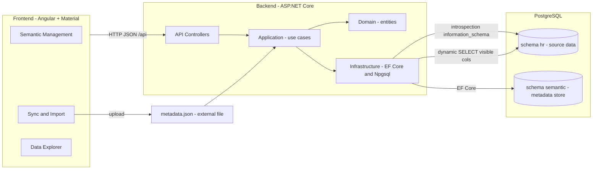
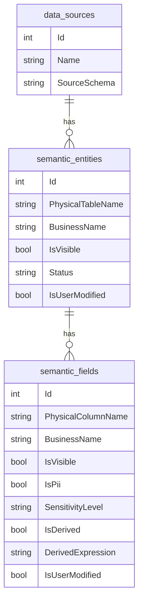
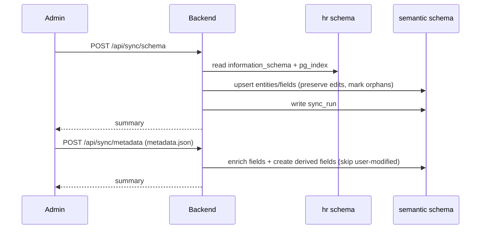

# Design Document – Semantic Layer Manager

## 1. Overview

The system is a mini semantic-layer platform. A **semantic layer** is an
abstraction between a physical relational database and business users: it presents
data in business terms, hides technical complexity and sensitive columns, and adds
descriptive metadata. This document describes the architecture, data model, the
synchronization process, the key design decisions and assumptions, the limitations
of the solution, and what I would add with more time.

The chosen demonstration domain is **Human Resources (HR)** on **PostgreSQL**. HR
is a good fit because it clearly shows the value of a semantic layer: hiding
sensitive columns (`ssn`, `salary`), translating technical names into business
terms, and exposing relationships in a friendly way.

---

## 2. Architecture

The solution has three deployable parts (Angular SPA, ASP.NET Core API,
PostgreSQL) and the backend follows a **layered / clean-architecture** structure
with dependencies pointing inward.



### Backend layers

- **Domain** (`SemanticLayer.Domain`): pure entities (`DataSource`,
  `SemanticEntity`, `SemanticField`, `SyncRun`) and enums (`ObjectStatus`,
  `SensitivityLevel`, `SyncType`). No dependencies.
- **Application** (`SemanticLayer.Application`): use-case services
  (`SyncService`, `MetadataMergeService`, `SemanticService`), DTOs, and
  abstractions (`ISemanticRepository`, `ISchemaIntrospector`, `IDataQueryService`).
  Depends only on Domain.
- **Infrastructure** (`SemanticLayer.Infrastructure`): EF Core `DbContext` and
  repository, the PostgreSQL introspector, and the dynamic data-query service.
  Implements the Application abstractions.
- **API** (`SemanticLayer.Api`): thin controllers, dependency injection,
  Swagger, CORS, and startup (migrations + initial sync).

This separation keeps business logic independent of the database engine: swapping
PostgreSQL for another engine means providing new `ISchemaIntrospector` and
`IDataQueryService` implementations only.

---

## 3. Data model

### 3.1 Physical layer (`hr` schema – the "organization's database")

Intentionally technical, with sensitive columns, so the semantic layer has value
to add:

- `departments(id, name, location, budget)`
- `job_titles(id, title, level)`
- `employees(id, first_name, last_name, email, ssn, phone, department_id,
  job_title_id, manager_id, hire_date, is_active)`
- `salaries(id, employee_id, amount, currency, effective_date)`

### 3.2 Semantic layer (`semantic` schema – managed by the app via EF Core)

- **`data_sources`** – a connected source (name, source schema). One default row
  in this demo; the model supports many.
- **`semantic_entities`** – maps 1:1 to a physical table. Holds `business_name`,
  `description`, `is_visible`, `status` (Active/Orphaned), `primary_key_column`,
  and `is_user_modified`.
- **`semantic_fields`** – maps to a physical column **or** is a derived field.
  Holds business attributes (`business_name`, `description`, `is_visible`), the
  physical type, metadata-file attributes (`is_pii`, `sensitivity_level`, `unit`,
  `display_format`), derived-field data (`is_derived`, `derived_expression`),
  `status`, `sort_order`, and `is_user_modified`.
- **`sync_runs`** – audit log of each sync (type, timestamps, change counts,
  summary).



The metadata store lives in a **separate schema (`semantic`)** in the same
PostgreSQL instance as the source. This keeps a clean separation of concerns
(business metadata vs. physical data) without adding infrastructure.

---

## 4. Synchronization process

There are two independent flows. A central design rule governs both:

> **Precedence: user edits > metadata file > schema defaults.**
> The physical schema defines what *exists*; the metadata file *enriches*;
> manual edits *win*. This is enforced by an `is_user_modified` flag that is set
> whenever a human edits an entity/field, after which automated syncs never
> overwrite that record's business attributes.

### 4.1 Schema sync (structural, non-destructive)

1. Read `information_schema.columns`/`tables` (plus `pg_index` for primary keys)
   for the source schema.
2. Reconcile against the semantic store:
   - **New** table/column → create a semantic record with a humanized default
     business name (`first_name` → "First Name").
   - **Disappeared** table/column → mark `status = Orphaned` (kept, **not
     deleted**, to preserve business edits and history).
   - **Type change** → refresh the physical type (structural, not a business edit).
3. Record a `sync_run` with the change counts.

Business edits and derived fields are always preserved across syncs.

### 4.2 Metadata merge (enrichment)

1. Parse the uploaded JSON file (keyed by `table` → `columns` / `derivedFields`).
2. For existing, non-user-modified fields: apply `is_pii`, `sensitivity_level`,
   `unit`, `business_name`, `description`, `is_visible`.
3. For `derivedFields`: create/update calculated fields (`is_derived = true`) whose
   value is a SQL expression over the same table (e.g.
   `first_name || ' ' || last_name`). This directly demonstrates **adding
   attributes that do not exist in the database**.
4. Record a `sync_run`.



### 4.3 Reading data through the layer

`GET /api/data/{entityId}` builds a dynamic `SELECT` that includes **only visible,
active fields**, aliases physical columns to their business names, and evaluates
derived expressions – with pagination and a total count. Example generated SQL for
*Employees* (sensitive/technical columns omitted, derived columns added):

```sql
SELECT "id", "first_name", "last_name", "email", "phone", "hire_date",
       "is_active",
       (first_name || ' ' || last_name) AS "full_name",
       (date_part('year', age(hire_date))) AS "tenure_years"
FROM "hr"."employees"
ORDER BY "id"
LIMIT @limit OFFSET @offset;
```

---

## 5. Key design decisions & assumptions

- **Layered/clean architecture** so business logic is engine-agnostic and testable.
- **Separate `semantic` schema** for the metadata store – clean separation, no extra
  infrastructure.
- **Non-destructive sync** (Orphaned instead of delete) so business investment in
  metadata is never lost when the physical schema changes.
- **Explicit precedence with `is_user_modified`** – a simple, predictable rule that
  makes syncs safe to run repeatedly (idempotent).
- **Derived fields as same-table SQL expressions** – demonstrates non-DB attributes
  while keeping the dynamic query simple (no runtime joins).
- **Security:** all identifiers used in dynamic SQL are validated against a strict
  whitelist and double-quoted (`SqlIdentifier`); table/column names originate from
  introspection, not user input; paging values are parameterized. Derived
  expressions come from the trusted metadata file and are guarded against statement
  terminators.
- **Automatic startup** (migrations + initial sync) so the system is immediately
  usable and reviewable.
- **Assumptions:** a single default data source; one "current" salary row per
  employee for the demo; the metadata file is authored by a trusted administrator.

---

## 6. Limitations

- No authentication/authorization (out of scope for the focused scenario).
- Derived fields are simple single-table SQL expressions, not a full expression DSL,
  and are not validated by execution before saving.
- A single database engine (PostgreSQL) is implemented, though the abstractions
  allow others.
- The Data Explorer shows one entity at a time; no cross-entity joins or filtering.
- No caching of introspection results; each sync reads the schema live.
- Automated tests are not included (the code is structured to be testable via the
  Application abstractions).

---

## 7. Future improvements

- **AuthN/AuthZ + RBAC** (e.g. who may see PII/Restricted fields), with row/column
  security.
- **Multiple data sources and engines** (SQL Server, MySQL) via additional
  introspector/query implementations.
- **Business glossary & relationships** – model foreign keys as navigable business
  relationships and allow joins in the explorer.
- **Richer derived fields** – a safe expression language with validation and preview.
- **Change management** – diff/preview before applying a sync, and per-attribute
  provenance (which value came from schema vs. file vs. user).
- **Sync history view** – each run is already persisted to `sync_runs` (type,
  timestamps, change counts, summary) as an audit trail; surfacing it through an API
  endpoint and a timeline/table in the UI was descoped to keep the focused scenario
  tight.
- **Performance** – cache introspection, add server-side filtering/sorting/search in
  the explorer.
- **Automated tests** – unit tests for the sync/merge precedence rules and
  integration tests using Testcontainers for PostgreSQL.
```
